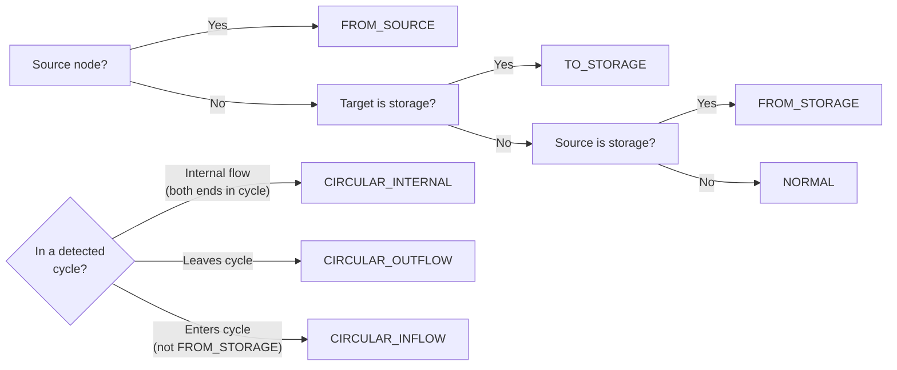
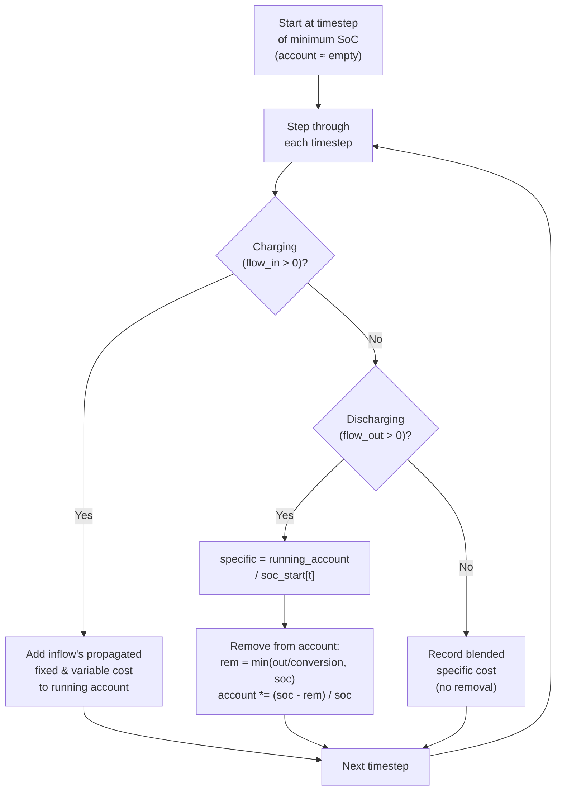

# Cost Propagation Algorithm – Flow Diagram

```mermaid
flowchart TD
    START(["calculate_costs_of_all_flows(results)"])
    START --> EXTRACT

    %% ── Phase 1: Data Extraction ──
    subgraph PHASE1["Phase 1 – Data Extraction"]
        EXTRACT["Extract from results:\n• flow_v (energy per timestep)\n• abs_var_cost_values (variable costs)\n• invest_costs_df (investment costs)"]
        EXTRACT --> BUILDGRAPH
        BUILDGRAPH["Build directed graph of active flows\n(energy > threshold)"]
        BUILDGRAPH --> DETECTCYCLES
        DETECTCYCLES["Detect cycles\n(nx.simple_cycles)"]
        DETECTCYCLES --> INDEXFLOWS
        INDEXFLOWS["Build index:\n• flows_from[node] = outgoing flows\n• flows_to[node] = incoming flows"]
        INDEXFLOWS --> EXTRACTSTORAGE
        EXTRACTSTORAGE["Extract storage_content\nand set of storage_nodes"]
    end

    %% ── Phase 2: Initialization ──
    subgraph PHASE2["Phase 2 – Initialization"]
        EXTRACTSTORAGE --> INITFLOWS
        INITFLOWS["Build f_all dict:\n• Per-flow DataFrame (flow_v, var costs)\n• fix_c_spec = invest_cost / total_flow\n• type classification\n• upstream inputs list"]
        INITFLOWS --> FIXSIMULTANEOUS
        FIXSIMULTANEOUS{"Simultaneous\ncharge/discharge\nfound?"}
        FIXSIMULTANEOUS -- Yes --> FIXSTORAGE["fix_simultaneous_storage_flows:\n• Net the charge/discharge\n• Scale var_c_tot proportionally\n• Re-apply zero-where-no-flow rule"]
        FIXSIMULTANEOUS -- No --> FINDCYCLES
        FIXSTORAGE --> FINDCYCLES
    end

    %% ── Phase 3: Cycle Detection ──
    subgraph PHASE3["Phase 3 – Cycle Classification"]
        FINDCYCLES["find_circular_nodes:\n• Skip pure storage 2-node cycles\n• Collect circular_nodes & internal_flows"]
        FINDCYCLES --> GETINOUT
        GETINOUT["get_cycle_inflows_outflows:\n• cycle_inflows = flows entering cycle\n• cycle_outflows = flows leaving cycle"]
        GETINOUT --> TAGFLOWS
        TAGFLOWS["Tag flow types:\n• CIRCULAR_INTERNAL\n• CIRCULAR_OUTFLOW\n• CIRCULAR_INFLOW\n(skip if FROM_STORAGE)"]
        TAGFLOWS --> VALIDATESTORAGE
        VALIDATESTORAGE["Validate no simultaneous\nstorage flows remain"]
    end

    %% ── Phase 4: Seed & Propagate ──
    subgraph PHASE4["Phase 4 – Cost Propagation"]
        VALIDATESTORAGE --> SEED
        SEED["_seed_source_flows:\n• propagated cost = own cost\n• mark calculated = True"]
        SEED --> LOOP

        LOOP{"Full sweep with\nno progress?"}

        LOOP -- No --> EACHFLOW
        EACHFLOW["For each uncalculated flow f"]

        EACHFLOW --> ISCALC
        ISCALC{"Already\ncalculated?"}
        ISCALC -- Yes --> LOOP

        ISCALC -- No --> CHECKTYPE
        CHECKTYPE{"Flow type?"}

        %% Internal cycle flows
        CHECKTYPE -- "CIRCULAR\nINTERNAL" --> CIRCINT["Set contrib = own cost\nMark calculated = True"]
        CIRCINT --> PROGRESS1["progress = True"]
        PROGRESS1 --> LOOP

        %% Circular outflows
        CHECKTYPE -- "CIRCULAR\nOUTFLOW" --> CIRCOUT_READY{"All internal flows\n& required inflows\ncalculated?"}
        CIRCOUT_READY -- No --> LOOP
        CIRCOUT_READY -- Yes --> CIRCOUT["_propagate_circular_outflow:\n• Sum internal own costs\n• Sum inflow propagated costs\n• Distribute to outflows\n  proportionally to energy\n• Mark calculated = True"]
        CIRCOUT --> PROGRESS2["progress = True"]
        PROGRESS2 --> LOOP

        %% Non-circular flows: check inputs
        CHECKTYPE -- "normal /\nFROM_SOURCE /\nTO_STORAGE" --> INPUTS_READY{"All usable\nupstream flows\ncalculated?"}

        INPUTS_READY -- No --> LOOP

        %% FROM_STORAGE
        INPUTS_READY -- Yes --> CHECKSTOR
        CHECKSTOR{"Flow type?"}

        CHECKSTOR -- "FROM_STORAGE" --> STORREADY{"Charging flow\ncalculated?"}
        STORREADY -- No --> LOOP
        STORREADY -- Yes --> PROPSTOR["_propagate_storage_outflow:\n• Find min-SoC start point\n• Track running cost account\n  per stored-content unit\n• Charge: add cost to account\n• Discharge: inherit specific cost\n  (account drained proportionally\n   to content removed)\n• Adjust for outflow_conversion_factor\n• Mark calculated = True"]
        PROPSTOR --> PROGRESS3["progress = True"]
        PROGRESS3 --> LOOP

        %% Normal / FROM_SOURCE / TO_STORAGE
        CHECKSTOR -- "normal /\nFROM_SOURCE /\nTO_STORAGE" --> PROPGEN["_propagate_generic_flow:\n• weight = flow / total_outflow\n  from source node\n• var_c_tot_p = upstream_sum * weight\n                + own var cost\n• fix_c_tot_p = upstream_sum * weight\n                + own fix cost\n• Build one-hop contrib breakdown\n• Mark calculated = True"]
        PROPGEN --> PROGRESS4["progress = True"]
        PROGRESS4 --> LOOP
    end

    %% ── Phase 5: Validation ──
    subgraph PHASE5["Phase 5 – Validation & Output"]
        LOOP -- Yes --> UNCALC{"Any flows still\nnot calculated?"}
        UNCALC -- Yes --> WARN["Log warning:\n'Cost calculation did not converge'"]
        UNCALC -- No --> VALIDATE
        WARN --> VALIDATE
        VALIDATE["Validate breakdowns:\n• contrib columns must sum to\n  fix_c_tot_p and var_c_tot_p\n• Log warning on mismatch"]
        VALIDATE --> RETURN(["Return f_all dict"])
    end
```

## Key Concepts

| Term | Meaning |
|------|---------|
| **Propagated cost** (`*_p`) | A flow's own cost + share of upstream costs |
| **Specific cost** (`*_spec`) | Cost per unit energy [EUR/kWh] |
| **Total cost** (`*_tot`) | Absolute cost over timestep [EUR] |
| **Fixed cost** (`fix`) | Investment-derived, constant over the year |
| **Variable cost** (`var`) | Dispatch-dependent, varies per timestep |
| **contrib** | One-hop cost breakdown (self + direct inputs) |
| **CIRCULAR_INTERNAL** | Flow inside a cycle (cost zeroed, kept as-is) |
| **CIRCULAR_OUTFLOW** | Flow leaving a cycle (receives pooled cycle cost) |
| **CIRCULAR_INFLOW** | Flow entering a cycle (feeds into pool) |

## Flow Type Classification

## Storage Outflow – Running Cost Account

